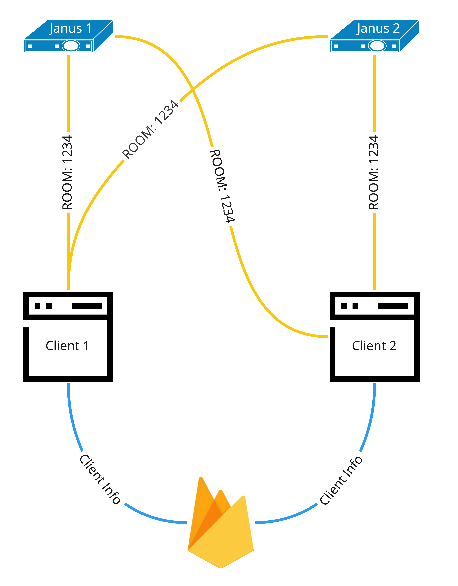
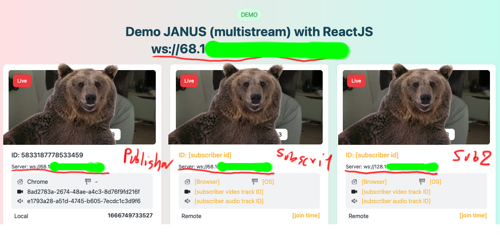

This is a [Next.js](https://nextjs.org/) project bootstrapped with [`create-next-app`](https://github.com/vercel/next.js/tree/canary/packages/create-next-app).

# Demo server is unavailable
The solution consumes a budget of around 100 US/month. It was too expensiveeeeee.
<picture>
  <a href="https://www.buymeacoffee.com/duckdev84" target="_blank"></a>
</picture>

## Demo Architecture


## Getting Started
First, run the development server:

```bash
cp .env-example
# config env
npm install

# dev on windows
npm run dev:win
# dev on macOS
npm run dev:mac
```

## Result


## ---
Open [http://localhost:3072](http://localhost:3072) with your browser to see the result.

You can start editing the page by modifying `pages/index.js`. The page auto-updates as you edit the file.

## Learn More

To learn more about Next.js, take a look at the following resources:

- [Next.js Documentation](https://nextjs.org/docs) - learn about Next.js features and API.
- [Learn Next.js](https://nextjs.org/learn) - an interactive Next.js tutorial.
